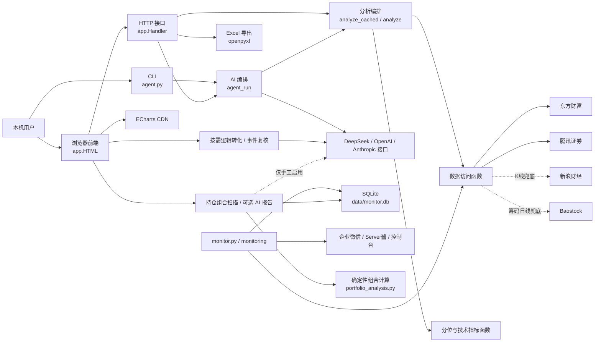
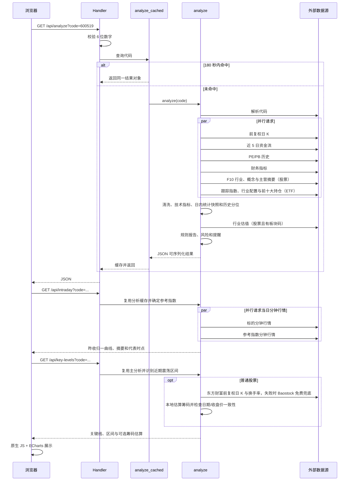

# 系统架构

## 总览

项目包含本机 Python Web 应用和独立的本地盯盘进程。浏览器、CLI 与盯盘适配层复用
`app.py` 的行情和分析能力；盯盘状态保存到 SQLite。没有远程服务器、消息队列、
自动交易或前端编译产物。

## 模块职责

| 区域 | 主要函数/对象 | 职责 |
| --- | --- | --- |
| 网络基础 | `http_text`、`fetch_json`、`api_post` | 外部 GET/POST、重试、解码 |
| 标的识别 | `resolve`、`_guess` | 代码解析、市场/类型/名称兜底 |
| 数据访问 | `fetch_kline`、`fetch_eastmoney_chip_kline`、`fetch_valuation`、`fetch_industry`、`fetch_fundamentals`、`fetch_company_context`、`fetch_etf_context`、`fetch_moneyflow` | 读取公开接口并转换字段 |
| 计算 | `sma`、`ema`、`rsi`、`macd`、`boll`、`percentile_rank`、`detect_consolidation_box`、`estimate_chip_distribution` 等 | 纯计算或近似纯计算 |
| 业务编排 | `analyze`、`build_report`、`build_alerts`、`build_key_levels` | 并行取数、组装稳定响应和独立关键位结果 |
| 缓存 | `analyze_cached`、`key_levels_cached`、`market_overview`、`market_history`、`_ETF_CONTEXT` | 180 秒分析缓存、关键位成功 6 小时/失败 5 分钟缓存、120 秒市场缓存、15 分钟多日市场缓存、ETF 披露成功 24 小时/失败 10 分钟缓存 |
| AI | `agent_run`、`generate_security_ai_report`、`generate_market_ai_report`、`panel_analyze`；`analyze_multidim` 仅兼容 | 单标的/大盘编号事实约束、工具调用与模型文字编排；旧多维页面入口已下线 |
| 导出 | `build_excel` | 调用分析并生成内存中的 XLSX |
| Web | `Handler`、`HTML` | 路由、JSON/文件响应、页面交互 |
| 盯盘仓储 | `MonitorRepository` | 自选、规则、分钟/每日快照、事件和草案缓存 |
| 三线预设 | `build_simple_rules`、`simple_rule_summary` | 将三个用户价格转换为确定性规则并提供简洁总览 |
| 规则引擎 | `RuleEngine` | 连续确认、冷却、回差、上穿/下穿与重新武装 |
| 盯盘编排 | `MonitorService` | 交易时段轮询、按需完整分析、触发和清理 |
| Web 盯盘 | `MonitorWebController` | 三线 API、脱敏总览、无副作用提醒预览和显式启停的后台线程 |
| 通知 | `CompositeNotifier` 等 | 控制台、企业微信和 Server酱 |
| 规则草案 | `RuleDraftAssistant` | 基础/高级数据隔离、单问题渐进确认、历史前低草案和 JSON 缓存 |
| 事件复核 | `EventExplanationAssistant` | 用事件和逻辑卡生成严格 JSON 复核结果、缓存和用量统计 |
| 持仓截图识别 | `HoldingOCRAssistant` | 校验截图、调用千问视觉、严格清洗结构化结果和 7 天缓存 |
| 持仓组合计算 | `build_portfolio_analytics` | 确定性计算共同截止日、趋势、贡献、集中度、相关性、强弱和历史诊断 |
| 持仓组合报告 | `PortfolioReportAssistant` | 编排 0 Token 扫描、DeepSeek/GPT 两阶段报告、用量和缓存 |
| 交易日历 | `TradingCalendar` | 读取本地开休市日期；文件缺失时明确回退到工作日 |

## 单标的查询链路

## 核心计算口径

- K 线：腾讯前复权日 K 优先；不足 30 条时尝试新浪日 K。
- 时间范围：过滤 `date.today() - (365 * 5 + 5) 天` 之前的数据，目标窗口约近
  5 年，拉取上限 `KLINE_N = 1300`；上游返回不足时不会补齐，实际窗口可能更短。
- K 线和 PE/PB 来自不同接口，样本起止和数量彼此独立。响应中的 `start/date/count`
  只描述 K 线，不代表估值序列完整范围。
- 分位：过滤 `None` 后，使用
  `(小于当前值数量 + 0.5 * 等于当前值数量) / 有效样本数 * 100`，保留 1 位。
- PE/PB：股票取东方财富 `PE_TTM`、`PB_MRQ`；当前分位样本不剔除负值。
- 行业中位：仅采用大于 0 的 PE/PB，与历史分位的负值处理不同。
- ETF/指数：不请求 PE/PB，使用价格分位。
- `NaN`/无穷：最终由 `_clean` 转为 `None`；抓取转换失败的行通常跳过。
- 前端不重复计算分位、技术指标或风险评分，只进行格式化和绘图。

实时行情会在所有日 K 计算完成后覆盖响应中的 `price`/`chg`，但 `price_pct`、
区间和规则报告仍基于最近日 K 收盘值。这是已知口径一致性风险，不应在未确认时改动。

`market_snapshot` 保留查询时点的开盘、日内高低、均价、量比、换手率和振幅，不再返回
买一/卖一。`GET /api/intraday` 独立读取标的和参考指数截至查询时点的当日分钟序列，按
各自昨收归一后计算相对强弱，并返回标的均价、分钟成交量、摘要和最多 8 个代表时点。
股票按上市板块选择市场指数；ETF 优先按公开跟踪指数名称通用匹配，失败时使用沪深 300
并标明宽基参考。分时失败不会影响 `/api/analyze` 的其他结果。

分时第一版不读取历史分钟数据，不判断复杂形态、龙头股组合或盘中买卖点。单标的 AI
只接收压缩摘要和代表时点，不接收整条分钟序列。大盘 AI 仍只读取查询时点的指数和板块
ETF 涨跌，不含分时、成交额、真实资金净流入、新闻、公告或海外市场。

`GET /api/key-levels` 与主分析、分时接口独立，只在用户点击时执行。震荡区间使用主分析
已经返回的前复权日 K，分别检查最近 40/60/80/100/120 日；价格覆盖、上下边界触碰次数和
方向性不满足条件时返回空区间，不强行画框。普通股票另读取东方财富前复权日 K、成交量和
换手率；瞬时失败或数据不足时再尝试 Baostock 的同口径前复权日线与换手率。随后按换手衰减和日内三角分布在本地估算平均成本、主要筹码峰、70%/90%成本区、
估算获利占比和简化分布。该结果不是东方财富客户端直接返回的筹码成品数据，也不是真实
账户持仓；估算获利占比不能证明持有人正在兑现。

筹码叠加要求外部数据与页面 K 线日期相同，且两路前复权收盘价偏差不超过 1%；否则只保留
可用的震荡区间并说明原因。ETF 因申购赎回机制第一版不估算筹码。关键位只用于 K 线展示，
不进入估值、PE/PB、分位、风险评分、规则报告、AI、Excel、盯盘或买卖信号。

布林带计算与响应字段暂时保留兼容，但当前页面、规则底稿、单标的 AI、多股技术提示、
K 线图和 Excel 导出不再消费或展示这些字段。

单标的按需 AI 报告由 `build_security_ai_evidence` 从现有分析结果和大盘快照生成连续编号的
原始事实目录。目录不包含 `report`、`risk.reasons` 或 `alerts` 的预写结论；模型自行选择
2 至 5 个重点、组织顺序和表达。涉及事实时必须返回 `[[E01]]` 形式的编号，服务端拒绝未知
编号并只向页面返回本次实际引用的事实。它只在用户点击时调用，不进入普通查询、启动预热
或分钟盯盘。规则报告仍保留为零 Token 数据底稿。

## 数据与缓存

Web 分析本身的进程内状态：

- `_ACACHE`：按原始代码字符串缓存完整分析，TTL 180 秒；
- `_INTRADAY_CACHE` / `_INTRADAY_COMPARISON_CACHE`：缓存分钟行情与相对强弱结果，成功
  60 秒、失败 15 秒；
- `_KEY_LEVEL_CACHE`：按代码缓存独立关键位结果，成功 6 小时、失败或错位 5 分钟；
- `_INDEX_REFERENCE_CACHE`：缓存 ETF 跟踪指数名称匹配，成功 24 小时，失败短缓存；
- `_MKT`：缓存市场概览，TTL 120 秒；
- `_INDUSTRY`：缓存行业板块主力净流入，TTL 120 秒；东财失败时读取
  `data/industry_flow_snapshot.json` 并标记 `stale=true`，该文件是运行时缓存，不提交；
- `_MKT_HISTORY`：按需缓存全部指数与板块 ETF 多日日线，TTL 15 分钟；只在组合分析时
  加载，不进入启动预热；
- 浏览器 `localStorage`：自选代码/名称/分组、当天分组轨迹、页面输入的模型 Key 和
  千问 Workspace Base URL。

重启服务后 Python 缓存清空。浏览器数据不会随服务重启清空。

自选分组仍只使用 `/api/watch_quotes` 返回的轻量行情，在前端按组员等权计算组均涨幅、
中位涨幅和上涨家数。`watch_group_history_v1` 以本机日期和组员代码签名隔离基线，
每组最多保留当天 72 次记录；日期或成员变化后重建基线。旧自选条目没有 `group`
字段时映射到“未分组”。

“同步回暖”要求组均涨幅较当天首次记录提升至少 0.3 个百分点，同时上涨占比提升至少
20 个百分点；“回升观察”表示只满足其中一项。这个状态只描述用户自定义样本的当日
变化，不进入风险评分、盯盘规则或 AI 分析，也不代表官方行业指数。

盯盘模块使用 `data/monitor.db`：分钟快照默认保留 7 天、事件 365 天、AI 草案
7 天；每日快照和用户规则默认长期保留。清理策略见 `MONITORING.md`。

持仓截图识别缓存位于 `holding_ocr_cache`，只保存图片 SHA-256 派生缓存键、模型名、
Token 数和结构化 JSON，7 天过期；不保存原图、Key 或 Base URL。识别仅在用户点击
“发送千问识别”时发生，不进入分钟轮询。识别行必须在浏览器校对表中补全后，才通过
持仓写入接口更新本地数量和成本。

持仓组合链路由 `monitoring/portfolio.py` 读取已保存持仓，并发复用 `analyze_cached`、
`market_overview` 和按需的 `market_history`。`monitoring/portfolio_analysis.py` 先用
确定性代码统一到共同数据截止日，计算 5/10/20/60 日组合趋势、相对大盘/板块强弱、
回撤、波动、期初市值口径贡献、仓位/行业/主题集中度、相关性覆盖和持仓强弱。缺少完整
窗口、近期历史质量差或覆盖不足时保留“数据不足”，不让坏数据参与板块排名或低风险
判断。`GET /api/monitor/portfolio-scan` 直接返回该快照，不需要 Key、Token 为 0，也不
创建 AI 报告记录。

历史诊断重放使用最近约 252 个交易日、每 5 日取样；每个历史状态只读取当时及以前的
数据，再观察随后 5/10 日表现。组合曲线按当前持仓数量静态回看，不含真实仓位变化、
买卖、现金、费用、分红或调仓，因此不是交易策略收益回测。

需要文字解释时，用户判断先写入 `portfolio_reports` 并锁定。第一轮模型输入只含组合
快照，不含用户判断；第二轮才读取锁定判断、第一轮结果和从同一快照提取的精简确定性
事实。第一轮同时接收程序生成的 `evidence_id -> fact` 目录；模型只能返回证据 ID，
服务端校验后还原为展示文字，未知 ID 会使报告失败。DeepSeek 使用兼容
`/chat/completions` 并关闭 thinking；GPT 使用 Responses API、
低 reasoning、`store:false`，默认 `gpt-5.6-sol`。两次调用在第一轮前原子预留额度，
失败后按实际已返回调用数和可得 Token 结算。相同供应商、模型、快照与判断缓存 7 天；
最近 7 次成功报告持续保留，失败和未完成记录不进入历史列表。分钟监听不访问该表，也
不调用报告模型。

逻辑卡保存在 `watch_logic`；事件复核结果保存在 `event_explanations`，同一事件内容和
逻辑卡内容的哈希相同才复用；每日调用和 Token 用量保存在 `ai_usage`。通知失败按渠道
写入 `notification_jobs`，后续轮询只重试失败渠道。

普通用户通过 `quick-setup` 只设置关注价、风险价和可选目标价；系统生成三线规则及
当日涨跌幅 `±3%` 异动规则。重复设置只事务性替换这些系统预设，手工高级规则继续
保留。分钟规则仍只使用本地确定性引擎，不调用模型。

Web 的 `/api/monitor/*` 与 CLI 共用 `data/monitor.db`。控制器按首次访问延迟创建，
测试注入临时数据库；运行状态只返回渠道名称和计数，不返回数据库路径、Webhook 或
SendKey。页面顶部浏览器 Key 不参与后台盯盘。

ETF 上下文先对基金类别读取公开资料；只要存在最近报告期行业配置或前十大持仓就返回，
跟踪标的是可选补充。这样名称尚未补全或资料页未给出跟踪标的的 ETF 也不会漏掉；没有
跟踪标的时页面只显示持仓和行业。它不参与 PE/PB、价格分位、技术指标、风险评分或盯盘规则。
持仓与行业配置是披露数据，必须保留各自报告期，不能视为实时仓位。

## 重要接口

| 方法与路径 | 作用 | 外部依赖 |
| --- | --- | --- |
| `GET /` | 内嵌前端；ETF 显示跟踪指数、行业配置和前十大持仓 | ECharts CDN |
| `GET /api/analyze` | 单标的完整分析；股票附日内概况与公司定位，ETF 附后台 `etf_context` 披露信息 | 行情/估值/F10 等公开接口 |
| `GET /api/intraday` | 标的与参考指数的当日分时、相对强弱摘要和代表时点；失败不影响主分析 | 腾讯分钟行情、ETF 跟踪指数名称匹配 |
| `GET /api/key-levels` | 点击后识别近期震荡区间；普通股票另返回本地筹码估算，失败不影响主分析 | 现有前复权 K；股票筹码优先东方财富，失败时 Baostock 前复权日 K 与换手率 |
| `GET /api/market` | 指数与行业板块主力净流入；东财失败时读取快照或回退旧板块 ETF 行情 | 腾讯指数报价、东方财富行业板块资金流 |
| `GET /api/name` | 自选名称补全 | 腾讯/东方财富 |
| `GET /api/watch_quotes` | 最多 30 个自选报价 | 腾讯/东方财富 |
| `GET /api/excel` | Excel 导出 | 数据接口、openpyxl |
| `POST /api/chat` | 工具型 AI 对话 | DeepSeek/兼容接口 |
| `POST /api/security_report` | 单标的按需独立分析；模型自主选重点，事实编号受服务端校验 | 现有分析/大盘缓存、DeepSeek |
| `POST /api/market_report` | 开放式 AI 大盘复盘；引用编号指数/板块事实 | DeepSeek |
| `POST /api/multidim` | 旧单标的三视角后端兼容接口；页面无入口 | DeepSeek |
| `POST /api/panel` | 多股分析与首席汇总 | DeepSeek，可选 OpenAI |
| `GET /api/monitor/overview` | 盯盘标的、运行状态和最近事件 | 本地 SQLite |
| `GET /api/monitor/holdings` | 读取本地已保存持仓 | 本地 SQLite |
| `POST /api/monitor/setup` | 保存三线和自动异动预设 | 本地 SQLite |
| `POST /api/monitor/holdings` | 批量确认持仓；整批校验失败则不写入 | 本地 SQLite |
| `POST /api/monitor/holding-ocr` | 手工发送单张截图并返回待校对持仓 | 阿里云百炼、7 天缓存 |
| `GET /api/monitor/portfolio-scan` | 0 Token 组合扫描和历史诊断重放 | 现有行情分析、多日市场缓存 |
| `GET /api/monitor/portfolio-report/latest` | 读取最近一次锁定判断和报告状态 | 本地 SQLite |
| `GET /api/monitor/portfolio-report/history` | 读取最近 7 次成功报告用于复盘 | 本地 SQLite |
| `POST /api/monitor/portfolio-report` | 生成独立持仓分析和事后观点对比 | 现有行情分析、DeepSeek/OpenAI、7 天缓存 |
| `POST /api/monitor/remove` | 删除一个盯盘标的及规则 | 本地 SQLite |
| `POST /api/monitor/simulate` | 用已保存风险价预览真实提醒格式，不入库或发送 | 本地 SQLite 只读 |
| `POST /api/monitor/logic` | 保存买入/持有逻辑、失效条件和复核事项 | 本地 SQLite |
| `POST /api/monitor/draft` | 按需将逻辑整理为最多 3 条待确认规则 | DeepSeek、7 天缓存 |
| `POST /api/monitor/explain` | 手动复核一条已触发事件 | DeepSeek、用量统计、7 天缓存 |
| `POST /api/monitor/runtime` | 启动、暂停或立即检查 | 本地规则/行情 |

所有手工 DeepSeek 请求可携带 `deepseek_model`。后端只接受
`deepseek-v4-flash` / `deepseek-v4-pro`，缺省时使用受同一白名单约束的 `AGENT_MODEL`；
模型名进入持仓报告、规则草案和事件复核缓存键。页面选择保存在浏览器 `localStorage`，
不会改变分钟盯盘的 0 Token 边界。

## 错误处理

- 数据源函数多采用重试、空列表或备用源降级；完整分析不足 30 根 K 线时返回
  `{"error": ...}`。
- API 先校验主要代码和 Key，但大部分业务错误仍以 HTTP 200 + JSON `error` 返回。
- `Handler` 捕获未处理异常并把异常文本返回前端，同时在终端打印堆栈。
- HTTP 请求无统一结构化日志；`Handler.log_message` 被禁用，当前有少量 `DEBUG` 输出。

## 外部与安全边界

- 服务只绑定 `127.0.0.1:8688`，不是面向公网设计。
- TLS 上下文当前关闭证书和主机名校验，属于待修复高优先级风险。
- 页面 Key 经本机 HTTP 传给后端，再由后端放入模型 API 的授权头；代码未持久化 Key。
- 持仓截图只在用户手工确认发送时上传至其填写的阿里云百炼 HTTPS 兼容接口；后端
  只允许 `*.aliyuncs.com/compatible-mode/v1`，并在外部错误返回前脱敏。
- ECharts 来自第三方 CDN，且页面把部分动态内容写入 `innerHTML`。在完成转义和资源
  固定前，不应把服务扩展为局域网或公网访问。
