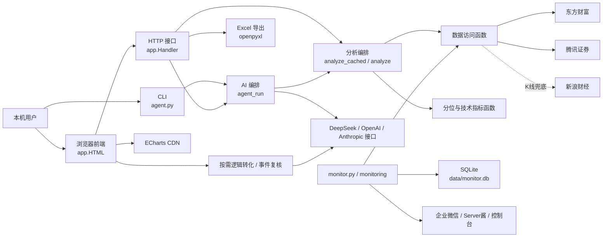
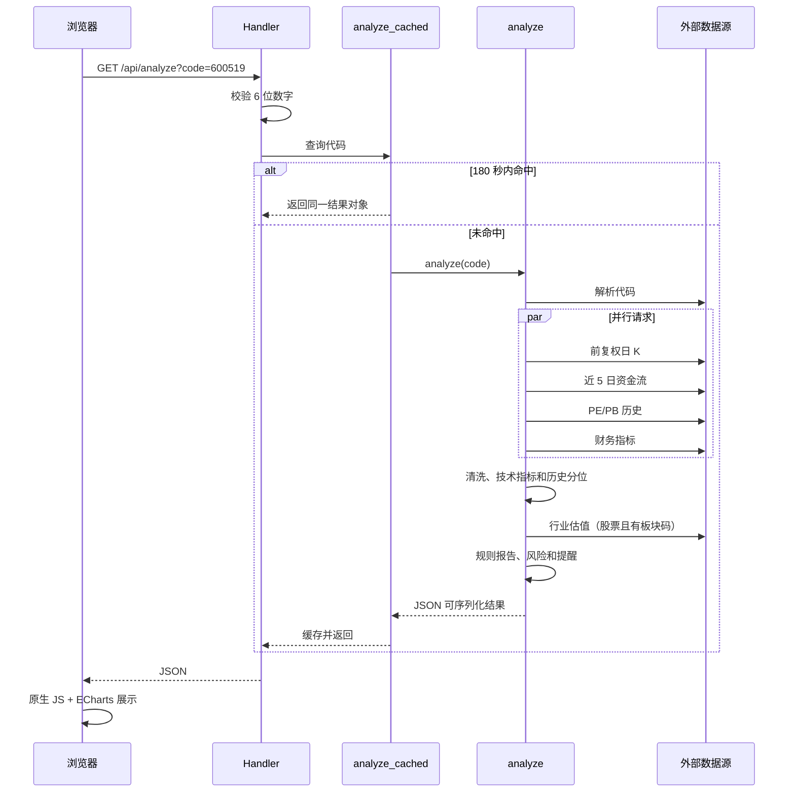

# 系统架构

## 总览

项目包含本机 Python Web 应用和独立的本地盯盘进程。浏览器、CLI 与盯盘适配层复用
`app.py` 的行情和分析能力；盯盘状态保存到 SQLite。没有远程服务器、消息队列、
自动交易或前端编译产物。

## 模块职责

| 区域 | 主要函数/对象 | 职责 |
| --- | --- | --- |
| 网络基础 | `http_text`、`fetch_json`、`api_post` | 外部 GET/POST、重试、解码 |
| 标的识别 | `resolve`、`_guess` | 代码解析、市场/类型/名称兜底 |
| 数据访问 | `fetch_kline`、`fetch_valuation`、`fetch_industry`、`fetch_fundamentals`、`fetch_moneyflow` | 读取公开接口并转换字段 |
| 计算 | `sma`、`ema`、`rsi`、`macd`、`boll`、`percentile_rank` 等 | 纯计算或近似纯计算 |
| 业务编排 | `analyze`、`build_report`、`build_alerts` | 并行取数、组装稳定响应 |
| 缓存 | `analyze_cached`、`market_overview` | 180 秒分析缓存、120 秒市场缓存 |
| AI | `agent_run`、`analyze_multidim`、`panel_analyze` | 工具调用与模型文字编排 |
| 导出 | `build_excel` | 调用分析并生成内存中的 XLSX |
| Web | `Handler`、`HTML` | 路由、JSON/文件响应、页面交互 |
| 盯盘仓储 | `MonitorRepository` | 自选、规则、分钟/每日快照、事件和草案缓存 |
| 三线预设 | `build_simple_rules`、`simple_rule_summary` | 将三个用户价格转换为确定性规则并提供简洁总览 |
| 规则引擎 | `RuleEngine` | 连续确认、冷却、回差、上穿/下穿与重新武装 |
| 盯盘编排 | `MonitorService` | 交易时段轮询、按需完整分析、触发和清理 |
| Web 盯盘 | `MonitorWebController` | 三线 API、脱敏总览、无副作用提醒预览和显式启停的后台线程 |
| 通知 | `CompositeNotifier` 等 | 控制台、企业微信和 Server酱 |
| 规则草案 | `RuleDraftAssistant` | 基础/高级数据隔离、单问题渐进确认、历史前低草案和 JSON 缓存 |
| 事件复核 | `EventExplanationAssistant` | 用事件和逻辑卡生成严格 JSON 复核结果、缓存和每日额度 |
| 交易日历 | `TradingCalendar` | 读取本地开休市日期；文件缺失时明确回退到工作日 |

## 单标的查询链路

## 核心计算口径

- K 线：腾讯前复权日 K 优先；不足 30 条时尝试新浪日 K。
- 时间范围：过滤 `date.today() - (365 * 5 + 5) 天` 之前的数据，目标窗口约近
  5 年，拉取上限 `KLINE_N = 1300`；上游返回不足时不会补齐，实际窗口可能更短。
- K 线和 PE/PB 来自不同接口，样本起止和数量彼此独立。响应中的 `start/date/count`
  只描述 K 线，不代表估值序列完整范围。
- 分位：过滤 `None` 后，使用
  `(小于当前值数量 + 0.5 * 等于当前值数量) / 有效样本数 * 100`，保留 1 位。
- PE/PB：股票取东方财富 `PE_TTM`、`PB_MRQ`；当前分位样本不剔除负值。
- 行业中位：仅采用大于 0 的 PE/PB，与历史分位的负值处理不同。
- ETF/指数：不请求 PE/PB，使用价格分位。
- `NaN`/无穷：最终由 `_clean` 转为 `None`；抓取转换失败的行通常跳过。
- 前端不重复计算分位、技术指标或风险评分，只进行格式化和绘图。

实时行情会在所有日 K 计算完成后覆盖响应中的 `price`/`chg`，但 `price_pct`、
区间和规则报告仍基于最近日 K 收盘值。这是已知口径一致性风险，不应在未确认时改动。

## 数据与缓存

Web 分析本身的进程内状态：

- `_ACACHE`：按原始代码字符串缓存完整分析，TTL 180 秒；
- `_MKT`：缓存市场概览，TTL 120 秒；
- 浏览器 `localStorage`：自选代码/名称/分组、当天分组轨迹和页面输入的模型 Key。

重启服务后 Python 缓存清空。浏览器数据不会随服务重启清空。

自选分组仍只使用 `/api/watch_quotes` 返回的轻量行情，在前端按组员等权计算组均涨幅、
中位涨幅和上涨家数。`watch_group_history_v1` 以本机日期和组员代码签名隔离基线，
每组最多保留当天 72 次记录；日期或成员变化后重建基线。旧自选条目没有 `group`
字段时映射到“未分组”。

“同步回暖”要求组均涨幅较当天首次记录提升至少 0.3 个百分点，同时上涨占比提升至少
20 个百分点；“回升观察”表示只满足其中一项。这个状态只描述用户自定义样本的当日
变化，不进入风险评分、盯盘规则或 AI 分析，也不代表官方行业指数。

盯盘模块使用 `data/monitor.db`：分钟快照默认保留 7 天、事件 365 天、AI 草案
7 天；每日快照和用户规则默认长期保留。清理策略见 `MONITORING.md`。

逻辑卡保存在 `watch_logic`；事件复核结果保存在 `event_explanations`，同一事件内容和
逻辑卡内容的哈希相同才复用；每日调用和 Token 用量保存在 `ai_usage`。通知失败按渠道
写入 `notification_jobs`，后续轮询只重试失败渠道。

普通用户通过 `quick-setup` 只设置关注价、风险价和可选目标价；系统生成三线规则及
当日涨跌幅 `±3%` 异动规则。重复设置只事务性替换这些系统预设，手工高级规则继续
保留。分钟规则仍只使用本地确定性引擎，不调用模型。

Web 的 `/api/monitor/*` 与 CLI 共用 `data/monitor.db`。控制器按首次访问延迟创建，
测试注入临时数据库；运行状态只返回渠道名称和计数，不返回数据库路径、Webhook 或
SendKey。页面顶部浏览器 Key 不参与后台盯盘。

## 重要接口

| 方法与路径 | 作用 | 外部依赖 |
| --- | --- | --- |
| `GET /` | 内嵌前端 | ECharts CDN |
| `GET /api/analyze` | 单标的完整分析 | 行情/估值等公开接口 |
| `GET /api/market` | 指数与板块行情 | 腾讯 |
| `GET /api/name` | 自选名称补全 | 腾讯/东方财富 |
| `GET /api/watch_quotes` | 最多 30 个自选报价 | 腾讯/东方财富 |
| `GET /api/excel` | Excel 导出 | 数据接口、openpyxl |
| `POST /api/chat` | 工具型 AI 对话 | DeepSeek/兼容接口 |
| `POST /api/market_report` | AI 大盘报告 | DeepSeek |
| `POST /api/multidim` | 单标的三视角报告 | DeepSeek |
| `POST /api/panel` | 多股分析与首席汇总 | DeepSeek，可选 OpenAI |
| `GET /api/monitor/overview` | 盯盘标的、运行状态和最近事件 | 本地 SQLite |
| `POST /api/monitor/setup` | 保存三线和自动异动预设 | 本地 SQLite |
| `POST /api/monitor/remove` | 删除一个盯盘标的及规则 | 本地 SQLite |
| `POST /api/monitor/simulate` | 用已保存风险价预览真实提醒格式，不入库或发送 | 本地 SQLite 只读 |
| `POST /api/monitor/logic` | 保存买入/持有逻辑、失效条件和复核事项 | 本地 SQLite |
| `POST /api/monitor/draft` | 按需将逻辑整理为最多 3 条待确认规则 | DeepSeek、7 天缓存 |
| `POST /api/monitor/explain` | 手动复核一条已触发事件 | DeepSeek、每日额度、7 天缓存 |
| `POST /api/monitor/runtime` | 启动、暂停或立即检查 | 本地规则/行情 |

## 错误处理

- 数据源函数多采用重试、空列表或备用源降级；完整分析不足 30 根 K 线时返回
  `{"error": ...}`。
- API 先校验主要代码和 Key，但大部分业务错误仍以 HTTP 200 + JSON `error` 返回。
- `Handler` 捕获未处理异常并把异常文本返回前端，同时在终端打印堆栈。
- HTTP 请求无统一结构化日志；`Handler.log_message` 被禁用，当前有少量 `DEBUG` 输出。

## 外部与安全边界

- 服务只绑定 `127.0.0.1:8688`，不是面向公网设计。
- TLS 上下文当前关闭证书和主机名校验，属于待修复高优先级风险。
- 页面 Key 经本机 HTTP 传给后端，再由后端放入模型 API 的授权头；代码未持久化 Key。
- ECharts 来自第三方 CDN，且页面把部分动态内容写入 `innerHTML`。在完成转义和资源
  固定前，不应把服务扩展为局域网或公网访问。
